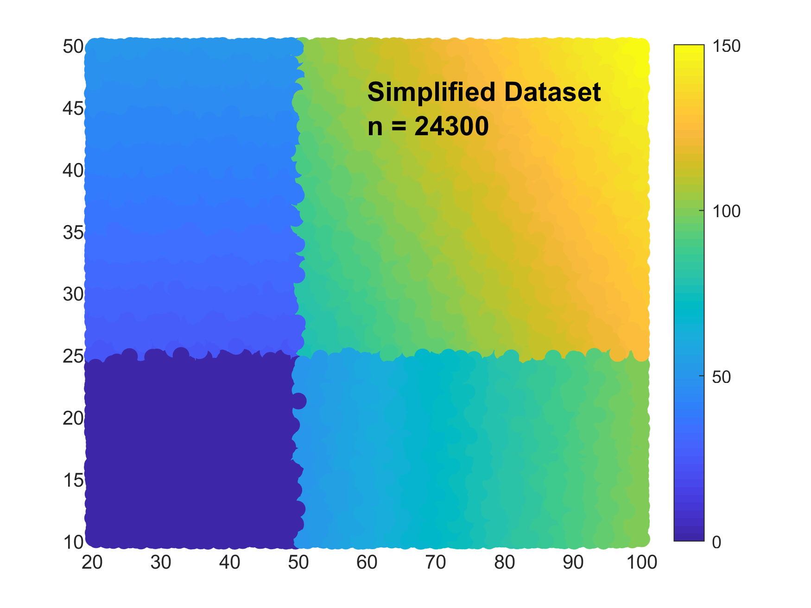

# MATLAB Code for Simplifying Scatter Plots

**MATLAB scatter plots** with **millions of points** are slow and ressource intensive.
However, most of the points are not visible since they are hidden by other points.
This code detects which points are **hidden** and **remove** them.

The used **algorithm** is particularly **efficient** and can handle millions of points:
* a pixel matrix is generated
* the points are circle occupying a given number of pixels
* the indices of the points are placed (in order) in the pixel matrix
* the points that do not appear in the pixel matrix will be invisible in the plot
* the invisible points are removed

This algorithm (o(1) complexity) features several advantages:
    - No need to compute the distance between all the points
    - The memory requirement is linearly proportional to the number of pixels
    - The memory requirement is linearly proportional to the number of scatter points
    - Computational cost is linearly proportional to the number of scatter points 

This code has been succesfully tested with **large datasets**:
* this algorithm is vectorized and many points are treated together.
* the number of points (chunk size) processed in a step can be selected.
* 100'000'000 points can be simplified in several minutes

## Example

Look at the examples [run_example.m](run_example.m).
A dataset with random points is succesfully simplifiy (by a factor of 50) without changing the scatter plot result.

    
    

## Compatibility

* Tested with MATLAB R2018b.
* No toolboxes are required.
* Compatibility with GNU Octave not tested but probably easy to achieve.

## Author

**Thomas Guillod** - [GitHub Profile](https://github.com/otvam)

## License

This project is licensed under the **BSD License**, see [LICENSE.md](LICENSE.md).
